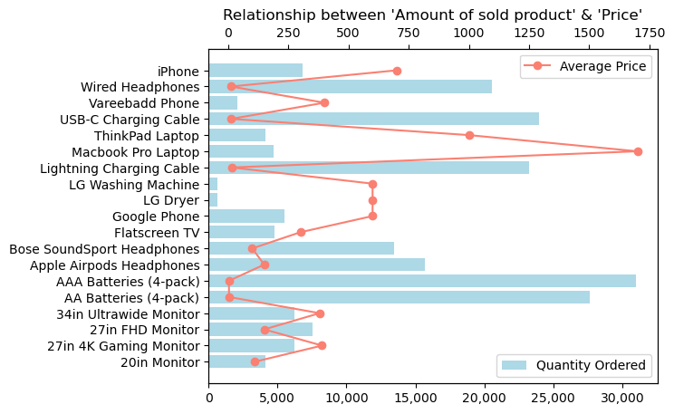
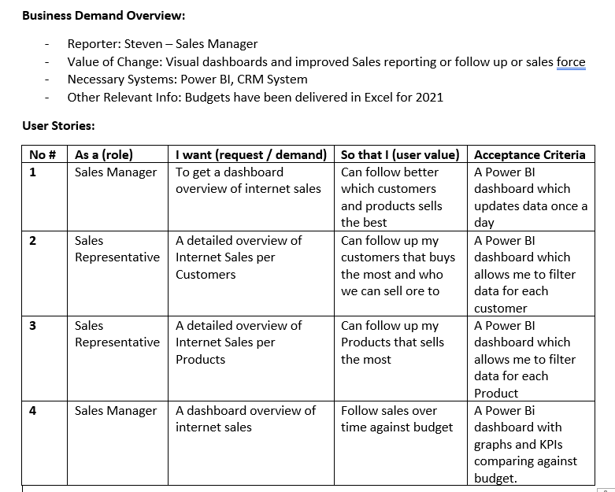
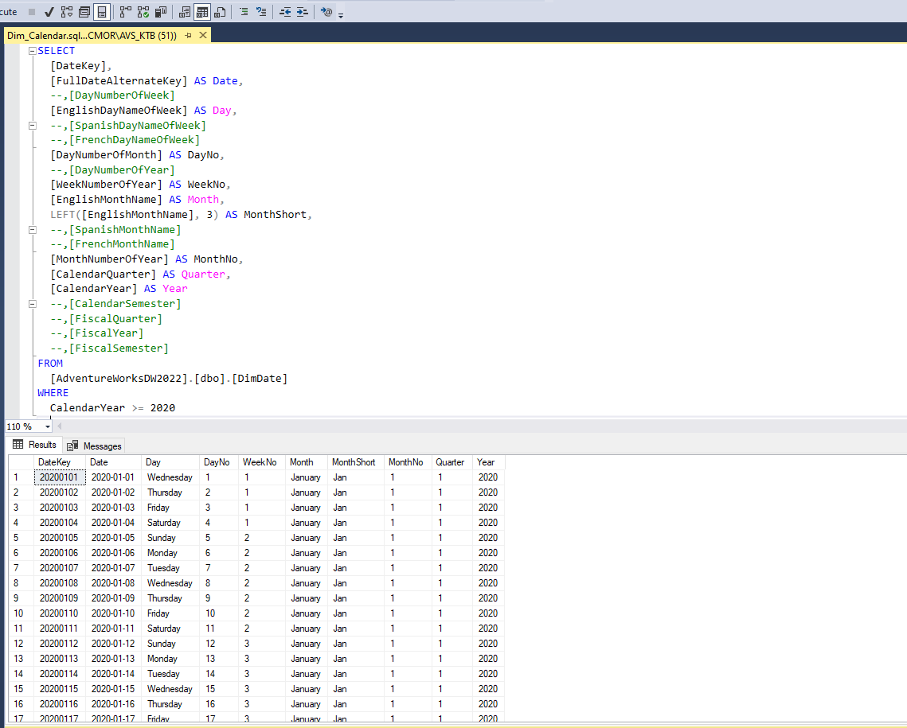
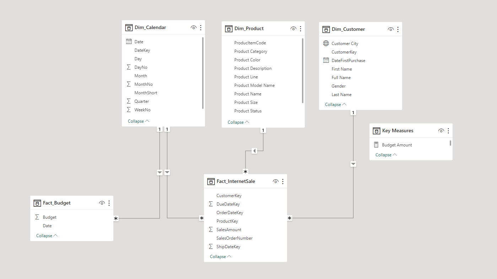
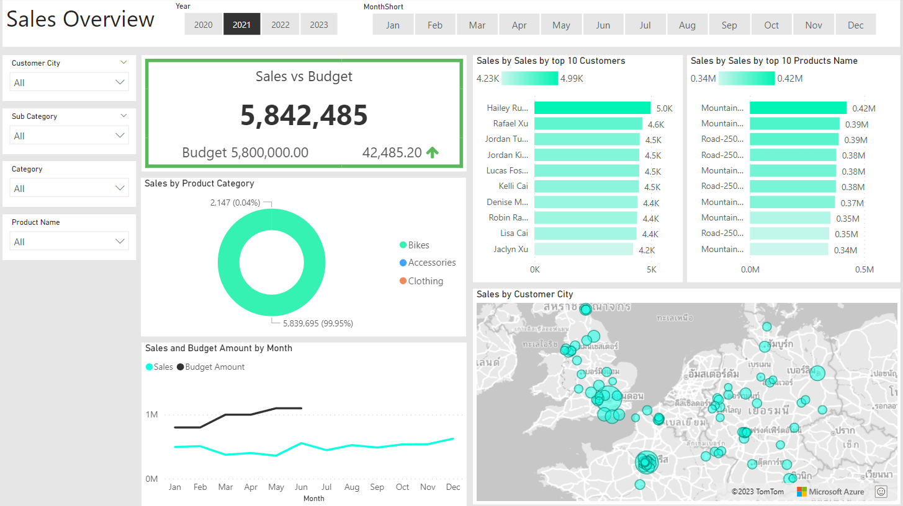
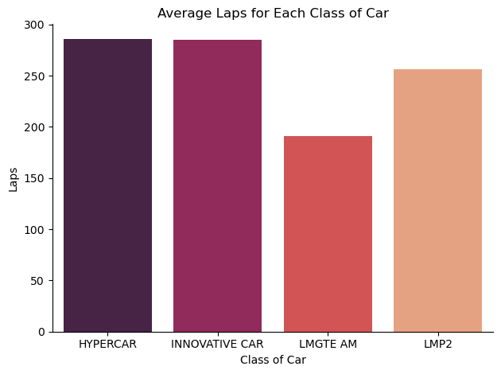
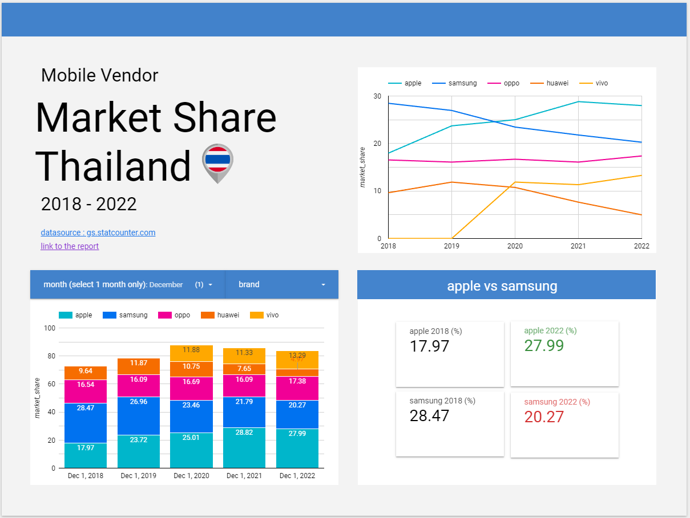

# Project 1: Sales Products Analysis 2019 

#### [Respond to the query using Python](https://github.com/oat0054/oat0054.github.io/blob/main/projects/Sales%20Products%20Analysis.pdf)
questions:
   - What was the best month for sales? How much was earned that month?
   - What City had the highest number of sales?
   - What time should we display adverstisement to maximize likelihood of  customer's buying product?
   - What products are most often sold together?
   - What product sold the most? Why do you think it sold the most?

key technique:
  - merge the 12 months of sales data into a single csv file
  - remove rows of missing values
  - remove text data rows that not related
  - change data type
  - add new columns
  - regular expression
  - aggregate
  - create chart with matplotlib.pyplot

# Project 2: Sales Management - Fulfilling the business request

#### [Data Cleansing & Transformation (SQL)](projects/sales_sql_bi)
- extract data using SQL
- clean data
- transform necessary data
- join table

#### [Creating a Data Model with Power BI](images/model_sales_powerbi.png)
- create a data model using the Star Schema
- connect FACT_Budget to FACT_InternetSales and other DIM tables

#### [Sales Management Dashboard](https://app.powerbi.com/links/vu6NZIJEoY?ctid=4dd8a667-96b2-4697-8036-3b1a6c85424e&pbi_source=linkShare)
- create a dashboard using Power BI
- design a dashboard for displaying sales overview
- design a dashboard for displaying customer details
- design a dashboard for displaying product details

# Project 3: 24 hours of le mans 2023: Web Scrapping

#### [Web Scrapping using Python](https://github.com/oat0054/oat0054.github.io/blob/main/projects/24%20hours%20of%20le%20mans%202023.pdf)
questions:
   - How many teams participated in the Le Mans 2023 event?
   - How many cars are there in each class?
   - What is the average number of laps for each class of car?
   - What are the top 3 cars for each class?
   - What is the performance comparison between the Chevrolet Corvette C8.R and the hypercar class?(based on the "labs" parameter)

task:
   - Scraping data using the Gazpacho library
   - Create a function to scrape team names
   - Create data frame
   - Create visualizations using matplotlib.pyplot

# Project 4: Mobile Vendor Market Share Thailand: Project Overview

#### [Data preparation in R](https://github.com/oat0054/bootcamp_projects/blob/main/smartphone_th/data%20transformation%20-%20phone_vendor_th_project%20%E2%80%93%20Datalore.pdf)
- combine sheets
- change column name to lowercase
- change raw format to long format
- clean missing values
- export CSV file

#### [Created Reports on Looker Studio](https://lookerstudio.google.com/s/uGCx8Gzshuc)
- created scorecard
- created bar chart
- created time series chart

# Project 5: query chinook database
#### [Using SQLite to Do Some Data Exploration](https://github.com/oat0054/oat0054.github.io/blob/main/projects/chinook.db.sql)
- join table
- filter
- aggregate
- create view

# Project 6: Order Pizza!
#### [Writing interactive code using R Studio to order pizza.](https://github.com/oat0054/bootcamp_projects/blob/main/order_pizza.R)
- readline
- while loop
- ifelse
- summary pizza order

