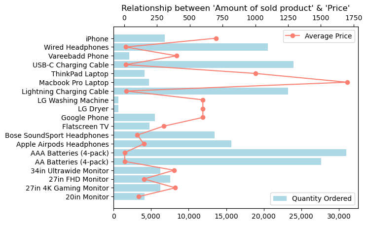
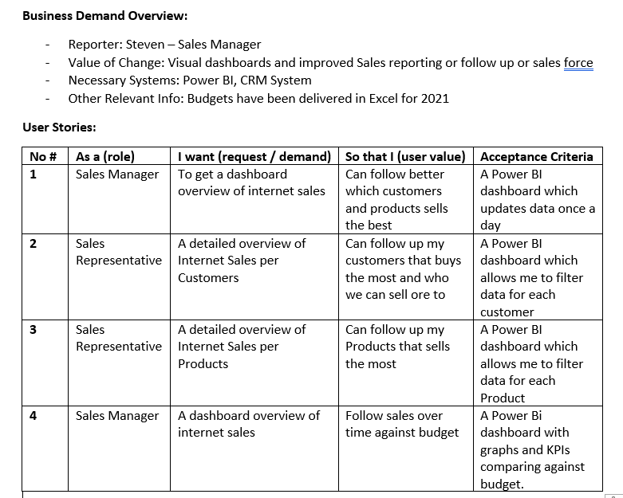
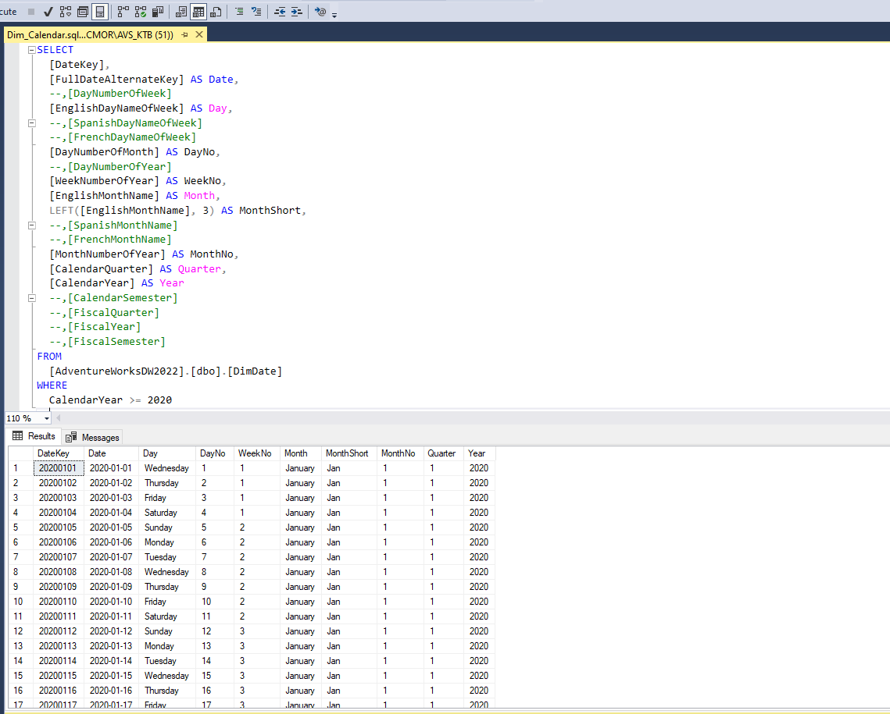
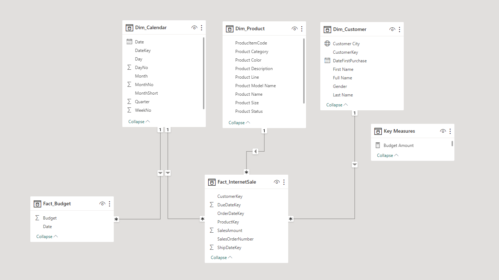
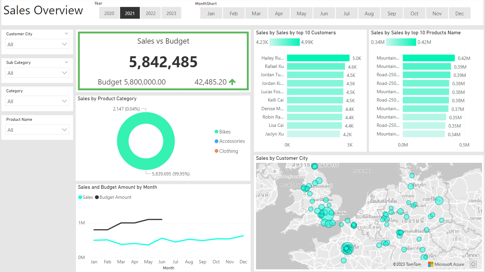
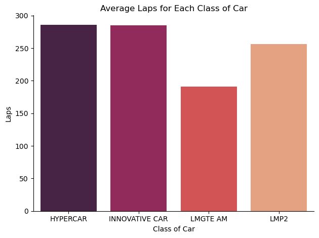

# Project Backgroud
Apex Machinery, established in 2004,  is a joint venture selling hydraulic excavators and others machinery in Thailand.

The company has significant amounts of data on its sales, marketing effort, operational efficiency and loyalty program that has been previously underutilized.
This project thoroughly analyzes Sales Opportunity Data and Field Histories to uncover why deals are lost to identify patterns, competitor movements, and internal friction points. The goal is to transform "Loss" into "Learning," giving management the data-driven insights needed to refine pricing strategies and sales tactics.

In the heavy machinery industry, a "Lost" deal isn't just a missed sale—it's a high-value asset worth millions of Baht going to a competitor. This Salesforce-integrated Dashboard was developed to perform a post-mortem on 83M THB in Lost Revenue.

By analyzing specific Loss Reasons and Competitive Landscapes, this project provides a data-driven autopsy of 54 lost units to understand why our Win Rate sits at 17.5%. The objective is to identify whether our hurdles are internal (process delays) or external (competitor pricing), enabling the management team to pivot strategies for the upcoming financial year.

Insights and recommendations are provided on the following key areas:
* **Lost Sales Trends Analysis:** Evaluation of historical lost sales patterns both in Thailand and by region, focusing on customer type, lost to competitor, and lost reason.

2. Why Customers Choose Competitors
Insight: "Competitor Price" is the number one reason we lose deals. Our biggest rivals are SANY and Caterpillar. Customers often leave us because they find a cheaper option elsewhere.

Recommendation: We should not just lower our prices. Instead, we should offer better payment plans (like special interest rates) or highlight our superior after-sales service to show customers that our machines are worth the higher price in the long run.

3. Problems in the Sales Process
Insight: Most of our deals fail at the "Quotation" and "Negotiation" stages. This means we are good at finding customers, but we struggle to finish the deal when it comes to the final price discussion.

Recommendation: We need to give our sales team "Comparison Guides" that clearly show why our machines are better than SANY or Caterpillar. This will give them more confidence to defend our price during negotiations.

4. Planning by Region
Insight: Different areas have different problems. Some regions lose deals because of price, while others lose deals because the competitor can deliver the machine faster.

Recommendation: We should create a specific plan for each area. For example, in regions where price is the biggest issue, we can offer free maintenance packages or extra parts to make our offer more attractive without cutting the main price.

# Project 1: Sales Products Analysis 2019 

#### [Respond to the query using Python](https://github.com/oat0054/oat0054.github.io/blob/main/projects/Sales%20Products%20Analysis.pdf)
questions:
   - What was the best month for sales? How much was earned that month?
   - What City had the highest number of sales?
   - What time should we display adverstisement to maximize likelihood of  customer's buying product?
   - What products are most often sold together?
   - What product sold the most? Why do you think it sold the most?

key technique:
  - merge the 12 months of sales data into a single csv file
  - remove rows of missing values
  - remove text data rows that not related
  - change data type
  - add new columns
  - regular expression
  - aggregate
  - create chart with matplotlib.pyplot

# Project 2: Sales Management - Fulfilling the business request

#### [Data Cleansing & Transformation (SQL)](projects/sales_sql_bi)
- extract data using SQL
- clean data
- transform necessary data
- join table

#### [Creating a Data Model with Power BI](images/model_sales_powerbi.png)
- create a data model using the Star Schema
- connect FACT_Budget to FACT_InternetSales and other DIM tables

#### [Sales Management Dashboard](https://app.powerbi.com/links/vu6NZIJEoY?ctid=4dd8a667-96b2-4697-8036-3b1a6c85424e&pbi_source=linkShare)
- create a dashboard using Power BI
- design a dashboard for displaying sales overview
- design a dashboard for displaying customer details
- design a dashboard for displaying product details

# Project 3: 24 hours of le mans 2023: Web Scrapping

#### [Web Scrapping using Python](https://github.com/oat0054/oat0054.github.io/blob/main/projects/24%20hours%20of%20le%20mans%202023.pdf)
questions:
   - How many teams participated in the Le Mans 2023 event?
   - How many cars are there in each class?
   - What is the average number of laps for each class of car?
   - What are the top 3 cars for each class?
   - What is the performance comparison between the Chevrolet Corvette C8.R and the hypercar class?(based on the "labs" parameter)

task:
   - Scraping data using the Gazpacho library
   - Create a function to scrape team names
   - Create data frame
   - Create visualizations using matplotlib.pyplot

